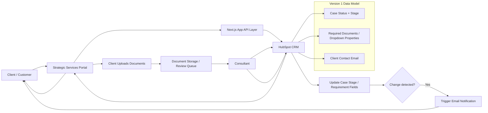

# Strategic Services for EIDLexit

## 1. Project Overview

Strategic Services for EIDLexit is a client-facing operational dashboard designed to track and manage EIDL exit case progression through a structured 12-stage workflow. The system allows a client to see where their case is in the process, upload supporting documentation for their financial overview and case packet, and see exactly what documents are required from them or from our internal team.

The platform is intended to give clients clarity, reduce communication delays, and keep internal staff aligned with HubSpot as the source of truth for case status and required documentation.

## 2. Business Objective

The core objective of the platform is to improve transparency and workflow efficiency for EIDLexit strategic services cases by:

- showing real-time case progression in a simple, client-friendly interface
- centralizing the required document checklist per case
- allowing the client to upload documents for submission and review
- keeping consultants informed of uploaded materials and missing information
- ensuring the case status is driven by HubSpot properties rather than fragmented manual updates

## 3. Target Users

### Client / Case Owner
- Reviews case status
- Uploads required documents
- Views checklist of outstanding items
- Understands where their case stands in the process

### Consultant / Internal Team
- Reviews uploaded files and packet materials
- Confirms required documents in HubSpot
- Updates case status or document requirements in the CRM
- Assesses whether additional documentation is needed from the client or from internal operations

### Admin / Operations
- Maintains system configuration
- Monitors workflow adherence
- Updates templates, required document categories, and process logic

## 4. Project Scope

### In Scope for Version 1
- Client portal to view current case stage
- 12-stage progression model for each case
- Upload and submission of documents into the case packet
- Display of required documentation based on HubSpot fields
- Display of additional documentation needs determined by consultants
- Real-time updates driven from HubSpot
- Consultant-facing handoff of files and information

### Out of Scope for Version 1
- Full custom internal CRM replacement
- Advanced workflow automation beyond HubSpot-driven updates
- Native accounting or financial modeling tools
- Multi-language portal support
- Complex internal user permissions system beyond basic role access

## 5. Core Functional Requirements

### 5.1 Case Progression Dashboard
The system must show a client’s current case position in a 12-stage process. Each stage should clearly communicate:

- current status
- date or time the case entered the stage
- next required action
- whether documents are missing

### 5.2 Document Packet Management
The system must support upload of case documents including:

- financial overview documentation
- business financial records
- supporting statements
- other required administrative or case-specific files

Each uploaded document should be associated with the client’s case and routed to the consultant for review.

### 5.3 Required Documents Workflow
The system must render required documents based on HubSpot dropdown selections or property values chosen by the consultant. This ensures the client sees a dynamic checklist instead of a static list.

Examples of required-document fields may include:

- financial overview documents
- tax documents
- income verification
- bank statements
- legal entity documents
- personal guarantor documents
- additional consultant-requested items

### 5.4 Real-Time Status Sync
The case status shown in the portal must reflect the status value in HubSpot. The system should update automatically or at a near real-time polling interval when HubSpot data changes.

### 5.5 Email Notification on Status or Requirement Changes
When any change occurs to the case stage, status, or required document list, the system must automatically send an email notification to the client/customer. This includes when:

- the case moves to a new stage
- the consultant updates document requirements
- additional documents are requested
- previous requirements are cleared or fulfilled
- the case is marked as pending, ready, or complete

The email should provide a concise summary of the change and direct the client to the portal for more detail.

### 5.6 Consultant Handoff
Documents uploaded by the client are forwarded to a consultant for review. The consultant can then:

- review uploaded files
- determine missing items
- update required-document fields in HubSpot
- move the case to the next appropriate stage

## 6. Twelve-Stage Case Progression Model

The platform will track each case through 12 stages. These stages are intended to cover the full EIDLexit strategic services workflow and may be mapped directly to HubSpot properties or custom deal properties.

### Proposed Stage Flow

1. Intake Received
2. Initial Review
3. Client Information Collected
4. Financial Overview Requested
5. Financial Overview Submitted
6. Documents Under Review
7. Consultant Review
8. Case Packet Drafting
9. Client Follow-Up Requested
10. Additional Information Needed
11. Case Ready for Submission / Final Review
12. Completed / Closed / Pending Next Action

### Stage Behavior
- Each stage should have a clear status label.
- Each stage should show whether action is required from the client, consultant, or internal team.
- When a case is moved in HubSpot, the front-end should re-render the relevant stage automatically.
- A “needs attention” or “action required” state should be surfaced when the case has missing documentation or holds.

## 7. Version 1 System Design

### 7.1 Source of Truth
In Version 1, HubSpot is the primary system of record for:

- client information
- case stage/status
- consultant assigned
- required-document categories
- missing document flags
- custom property values that drive front-end rendering

This design reduces duplicate data entry and keeps all operational updates centralized.

### 7.2 Front-End Layer
The user-facing application will be built using Next.js and TypeScript. It should provide a client portal that:

- reads HubSpot case data securely
- renders status progression based on HubSpot property values
- displays required documents based on consultant-configured properties
- allows client uploads for the case packet
- surfaces a clear document checklist and missing items

### 7.3 Document Upload Layer
The upload layer will:

- allow drag-and-drop or file selection
- store files in a secure document repository or object storage service
- attach metadata such as case ID, document type, uploaded date, and uploader
- notify the consultant or internal team when a new document arrives

### 7.4 Consultant Workflow Layer
The consultant interacts with HubSpot properties to indicate:

- which items are needed
- whether the case is awaiting review
- which documents are complete
- if additional documents are necessary before moving to the next stage

This makes the consultant’s decision the authority for document requirements displayed to the client.

### 7.5 Data Flow

1. Client record and case details are created in HubSpot.
2. The app reads deal/contact properties from HubSpot.
3. The client sees status progression and required document checklist.
4. Client uploads documents to the portal.
5. Files are forwarded or assigned to the consultant for review.
6. Consultant updates HubSpot properties and document requirement values.
7. If the case stage or document requirements change, the system triggers an email notification to the client.
8. The portal updates automatically with the latest status and checklist.

## 8. Functional User Journey

### Client Journey
1. Client logs in to the portal.
2. Client sees their current case stage and overall progress.
3. Client reviews required files and notes any missing items.
4. Client uploads documents for the packet or financial overview.
5. Client sees confirmation that the files were uploaded and forwarded for consultant review.
6. If the case stage or document requirement changes in HubSpot, the client receives an email notification.
7. Client receives updated status when HubSpot changes.

### Consultant Journey
1. Consultant reviews client record in HubSpot.
2. Consultant selects the appropriate document requirements in dropdown properties.
3. Consultant updates case stage as work advances.
4. Consultant reviews new uploads and determines if additional files are needed.
5. Consultant marks the case complete or moves it to the next workflow stage.

## 9. Data Model and Properties

The system depends on HubSpot properties that drive the user interface. Recommended structure:

### Case / Deal Properties
- Case Stage
- Case Status
- Client Name
- Client Email
- Consultant Assigned
- Current Case Progress
- Documents Required
- Documents Missing
- Upload Complete
- Last Updated
- Next Action

### Document Properties
- Document Type
- Upload Date
- Submitted By
- Reviewer
- Approved / Rejected
- Notes
- Required / Optional

### Example Logic
- If Case Stage = "Financial Overview Requested", render financial documentation required list.
- If Consultant selects "Additional Documents Needed" in HubSpot dropdown, show those categories in the client portal.
- If uploaded file count exceeds required threshold, show “Documents Received” and hide missing items.
- If the HubSpot property for Case Stage or Required Documents changes, trigger an email notification to the client email address.

## 10. Tool Requirements and Technical Stack

### Front-End
- Next.js
- React
- TypeScript
- Tailwind CSS
- App Router structure

### Back-End / Integration
- HubSpot API / CRM integration
- secure document upload endpoint(s)
- optional server-side API routes for fetching HubSpot data
- service layer for mapping HubSpot properties to UI state

### Hosting / Deployment
- Vercel or equivalent modern Next.js hosting platform
- environment-based configuration for API keys and HubSpot credentials

### Dev Tools
- Node.js
- npm
- GitHub
- ESLint
- TypeScript compiler
- Postman or API testing tools for HubSpot integration testing

### Optional Future Tools
- Cloud storage (e.g., S3 or equivalent object storage)
- webhook listeners for real-time updates
- notification services, including HubSpot email or external email automation
- audit log / activity tracking

## 11. System Communication Diagram

The following diagram describes how data moves through the system and where notifications are triggered:

### Diagram Explanation
- HubSpot is the system of record for client details, case stage, and required-document values.
- The Next.js app reads HubSpot data and renders the client-facing status and checklist.
- When the consultant updates a stage or required documents in HubSpot, the app detects the change.
- The system then triggers an email to the client/customer notifying them of the update.
- Client uploads are sent to the document review pipeline and then routed to the consultant.
- The portal refreshes automatically with the latest state from HubSpot.

## 12. Non-Functional Requirements

### Performance
- The dashboard should load quickly with minimal client waiting time.
- Document lists and status updates should refresh promptly after HubSpot data changes.

### Security
- Only authorized users should access client information.
- Client data should be protected in transit and at rest.
- Sensitive file uploads should require secure storage and permission checks.

### Reliability
- The system should handle failed HubSpot API calls gracefully.
- The UI should show a fallback state when status or document data is unavailable.

### Usability
- The portal should be intuitive for non-technical users.
- Priority actions should be obvious and clearly labeled.
- Important states such as missing documents or consultant review should be visually emphasized.

## 13. System Architecture

### High-Level Architecture

Client Portal (Next.js Front-End)
        |
        v
HubSpot CRM / Data Source
        |
        v
API Layer / Integration Logic
        |
        +--> Status Rendering
        +--> Required Documents Rendering
        +--> Upload Forwarding
        +--> Consultant Review Hand-off
        +--> Email Notification Trigger

### Architectural Principles
- HubSpot is authoritative for operational state.
- The front-end is a presentation and interaction layer, not the system of record.
- The portal should reflect the same source of truth as internal operations.
- Consultant decisions are translated into HubSpot property values and automatically exposed to the client portal.
- Any relevant change in stage or required documents must trigger a client email notification.

## 14. Risks and Constraints

### Risks
- HubSpot property naming inconsistencies may cause rendering issues.
- File uploads may be missing required metadata if not validated.
- Client confusion may occur if status labels are not clearly explained.
- Consultant updates may lag if property changes are not synchronized in real time.

### Constraints
- Version 1 depends on HubSpot being the system of record.
- Real-time behavior should not rely on internal custom databases for the initial phase.
- The portal must support the consultant-defined document requirements without creating duplicate manual tracking.

## 15. Success Criteria

The project is considered successful when:

- cases clearly display their current stage and progress
- required documents render based on consultant-selected HubSpot dropdown values
- client uploads are successfully forwarded to consultants
- case progression updates reflect live HubSpot changes
- missing items and next actions are visible without confusion
- any stage or document requirement change triggers a client email notification
- the process is clear to both clients and internal staff

## 16. Recommended Milestones

### Phase 1: Discovery and Requirements
- confirm all 12 stages
- define HubSpot properties
- map consultant actions to UI behavior
- validate document categories

### Phase 2: MVP Build
- build client portal shell
- integrate HubSpot status data
- create document upload flow
- render required document checklist

### Phase 3: Consultant Workflow Integration
- connect consultant updates to HubSpot properties
- validate automatic UI updates
- confirm file forwarding and review process

### Phase 4: QA and Launch
- test status syncing
- validate upload flows and permissions
- review accessibility and usability
- deploy to production

## 17. Proposed Technical Recommendations for Version 1

- Use a dedicated API layer to normalize HubSpot responses before sending them to the UI.
- Store document metadata in a structured format so the consultant can filter by document type or date.
- Maintain a clear mapping between HubSpot field names and UI labels to avoid user confusion.
- Add logging for failed document uploads, missing property values, and HubSpot sync issues.
- Include a lightweight “status timeline” component for the 12-stage case journey.

## 18. Summary

Strategic Services for EIDLexit is a user-friendly, status-driven case management portal that keeps the client informed while allowing the consultant to control the workflow through HubSpot. In Version 1, HubSpot acts as the single source of truth for case status and required documentation, while the client portal provides a clean interface for viewing progress, uploading supporting documentation, and understanding what is needed next.

This architecture is intentional: it keeps the operational process centralized, reduces duplicate data entry, and ensures the client-facing experience reflects real-time consultant decisions without requiring a separate internal workflow system in the first release.
